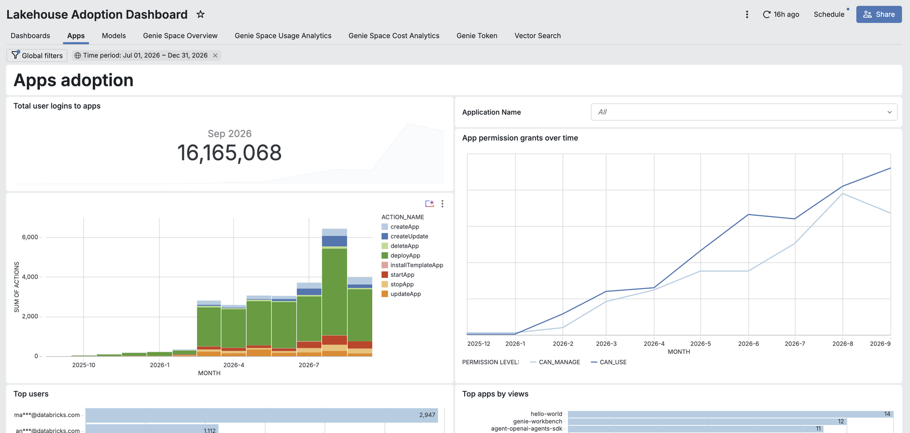
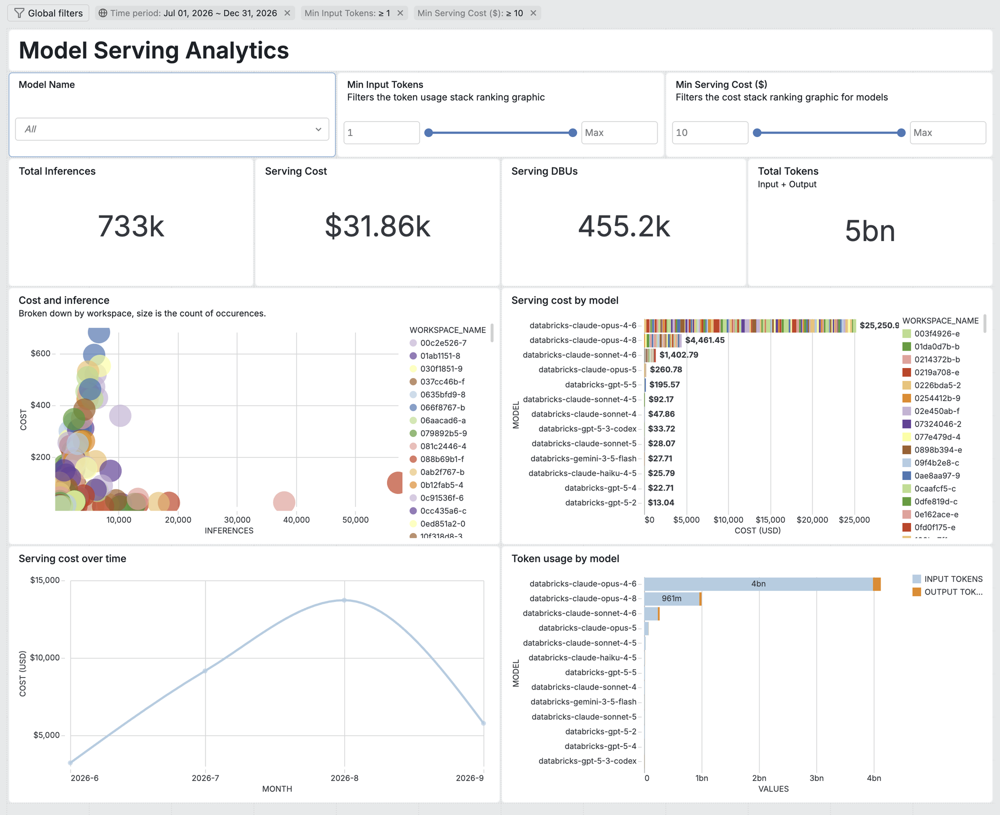

# Databricks Adoption Monitor

An Asset Bundle that inventories and measures adoption of AI/BI Dashboards,
Genie, Databricks Apps, Model Serving, registered models, and Vector Search.
The workflow publishes a conformed dimensional model and governed Unity Catalog
Metric Views, then serves them through an AI/BI dashboard.

## Visual walkthrough

> **Note:** Identifiers in these screenshots have been anonymised or trimmed for
> publication — workspace names appear as hashed strings and the app list is
> limited to sample apps. In a live deployment these are the real, human-given
> app and workspace names (user emails are masked by the dashboard itself).

The Apps page tracks login volume, the app-action mix over time, permission
grants, and the top users and apps:



The Models page surfaces inference, serving cost, DBU, and token KPIs, with
per-model cost and token-usage breakdowns:



## Deploy

Prerequisites:

- Unity Catalog with access to the required `system.*` tables;
- a writable target catalog and schema;
- a SQL warehouse;
- Databricks CLI authentication for the target workspace.

Validate, deploy, and run with environment-specific overrides:

```bash
databricks bundle validate --strict \
  --var="catalog_name=<catalog>,schema_name=<schema>,my_warehouse_id=<warehouse-id>"
databricks bundle deploy \
  --var="catalog_name=<catalog>,schema_name=<schema>,my_warehouse_id=<warehouse-id>"
databricks bundle run adoption_dash_job \
  --var="catalog_name=<catalog>,schema_name=<schema>,my_warehouse_id=<warehouse-id>"
```

The default `lookback_days` is 365. Genie conversation comments can be disabled
for very large workspaces with `enable_genie_feedback_comments=false`.

## Data and semantics

- `src/01_get_metadata.ipynb` refreshes legacy workspace-API metadata tables.
- `src/02_*.sql` refreshes the legacy physical facts.
- `src/04_conformed_dimensions.sql` through
  `src/08_verify_conformed_model.sql` publish and verify the conformed model.
- `src/metric_views/` contains governed semantic definitions.
- `src/dashboards/lh_adoption_dashboard.lvdash.json` queries Metric Views and
  includes the Vector Search page.

See [the conformed model guide](docs/conformed-model-and-metric-views.md) and
[the cost attribution reference](docs/data-model-and-cost-attribution.md).

## Upgrading from the legacy model

The current release dual-publishes every existing `adb_*`, `mvFact*`, and
`*_table` physical table for one major-release compatibility window. Existing
custom readers continue to work after upgrade, while the bundled dashboard uses
Metric Views.

An old workflow version only refreshes the legacy model. The upgraded workflow
must run to refresh both models. Legacy object retirement is intentionally
deferred until downstream usage has been inventoried and a separate major
release is approved.

## Development

```bash
uv run --isolated --with-requirements requirements-dev.txt pytest
```

Runtime SQL invariants execute as part of the bundle workflow.

## How to get help

Databricks support doesn't cover this content. For questions or bugs, please open a GitHub issue and the team will help on a best effort basis.

## License

&copy; 2026 Databricks, Inc. All rights reserved. The source in this project is provided subject to the [Databricks License](https://databricks.com/db-license-source).  All included or referenced third party libraries are subject to the licenses set forth below. The full license text is in [`LICENSE.md`](LICENSE.md); complete third-party attributions are in [`NOTICE.md`](NOTICE.md).

| library      | description                  | license      | source                                        |
|--------------|------------------------------|--------------|-----------------------------------------------|
| pyyaml       | YAML parser and emitter      | MIT          | https://github.com/yaml/pyyaml                |
| pytest       | Testing framework            | MIT          | https://github.com/pytest-dev/pytest          |
| pytest-mock  | Pytest mocking fixture       | MIT          | https://github.com/pytest-dev/pytest-mock     |
| databricks-sdk | Databricks SDK for Python  | Apache 2.0   | https://github.com/databricks/databricks-sdk-py |
| pyspark      | Apache Spark Python API      | Apache 2.0   | https://github.com/apache/spark               |
| requests     | HTTP library                 | Apache 2.0   | https://github.com/psf/requests               |
| pandas       | Data analysis library        | BSD 3-Clause | https://github.com/pandas-dev/pandas          |
